# Guide

<!-- HIERARCHY
  ##   a zone or area of the app        (Library, Game settings, Store, Settings)
  ###  one control, button or field       (the thing being documented)
       screenshot goes right under the ### line
       description goes under the screenshot, 1-3 sentences
  Screenshots live in docs/site/src/user/ss/ and are numbered. Next free number: 11.
-->

## First Steps

### Welcome Page

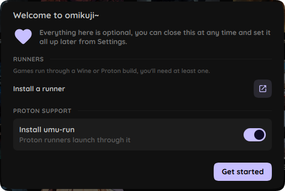

This is the welcome page where you can get started with omikuji. Yes it's very tiny. From here you can click the 'install runner' button to install a runner from the default list.

If your system lacks umu, as you can see, you can choose to let it install by keeping the toggle on. It'll install a built-in umu-run. If it happens that you have umu-run already installed system-wide, it'll hide the option.

### Welcome's Component Installer

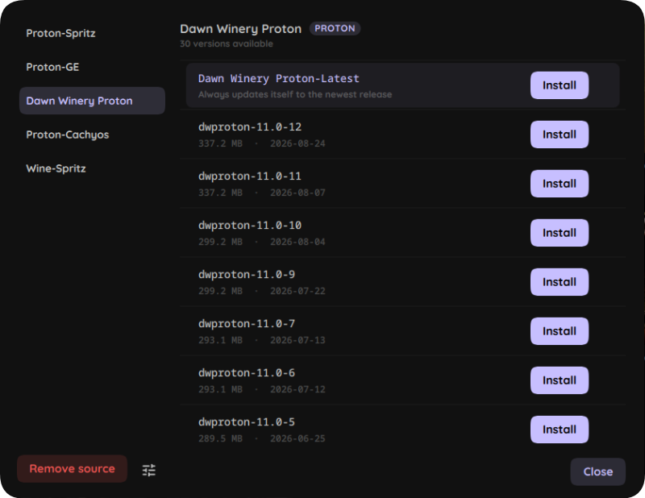

This is the welcome component installer where you can install a runner from the default list by clicking install (optionally you can choose which version of each release with the filter, if more than one option is available (_v3, x86_64, etc.)).

The 'Latest' option will install the latest release and it'll update automatically the next time you start omikuji, if a new release is available.

### Logging into Epic Games / GOG

First, select one of the two stores in the left navbar.

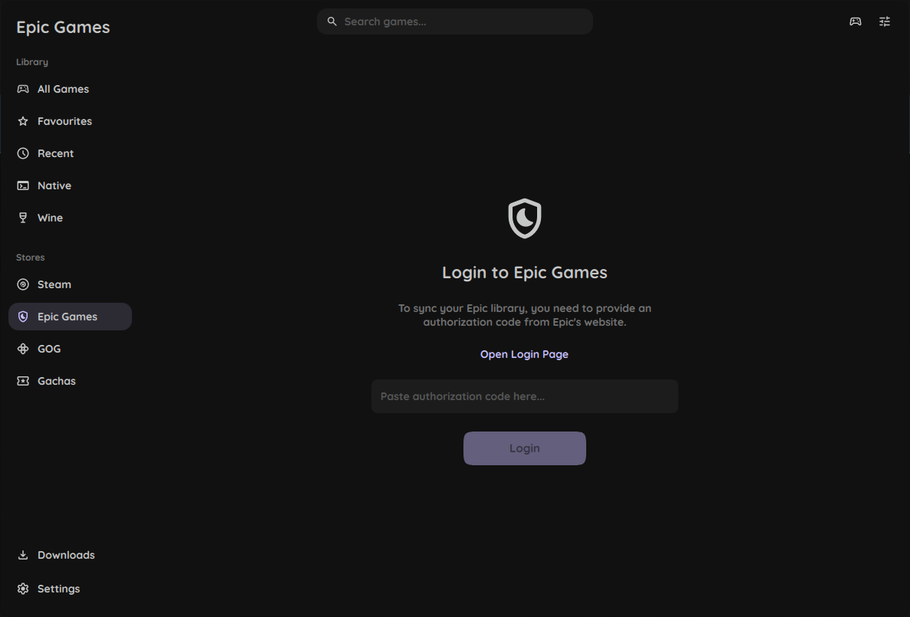

Then, click the 'Open Login Page' text. It'll redirect you to the Epic Games or GOG login page. From there, login with your account, it'll open one of the two pages (Epic Games and GOG respectively).

For Epic Games, you need to copy the authorizationCode key.
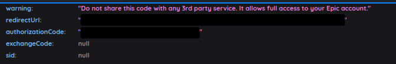

For GOG, you need to copy the authorization code from the link itself after the `code=` text (mind it's very long. make sure to copy it all). 
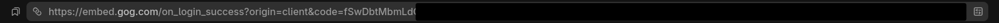

Paste the code into the input field and click 'Login'.

### Adding/Installing a Game

Omikuji has a bunch of ways to install games. 

#### Stores

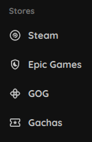

#### Steam

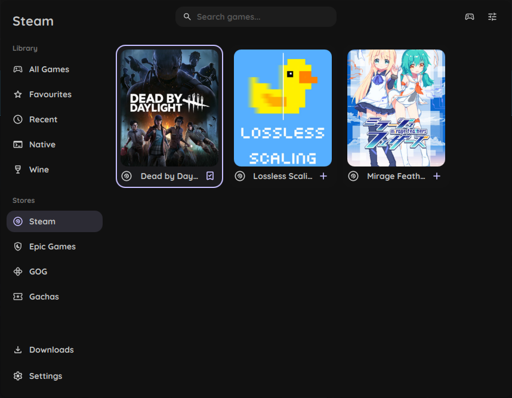

Steam doesn't install anything from the launcher, you need to install games from Steam itself. However, you can import them in your library by just clicking the `+` button on the bottom left of the card. Importing Steam games gives them the `steam` runner type, that means it delegates the game launching to the Steam client.

#### Epic Games / GOG

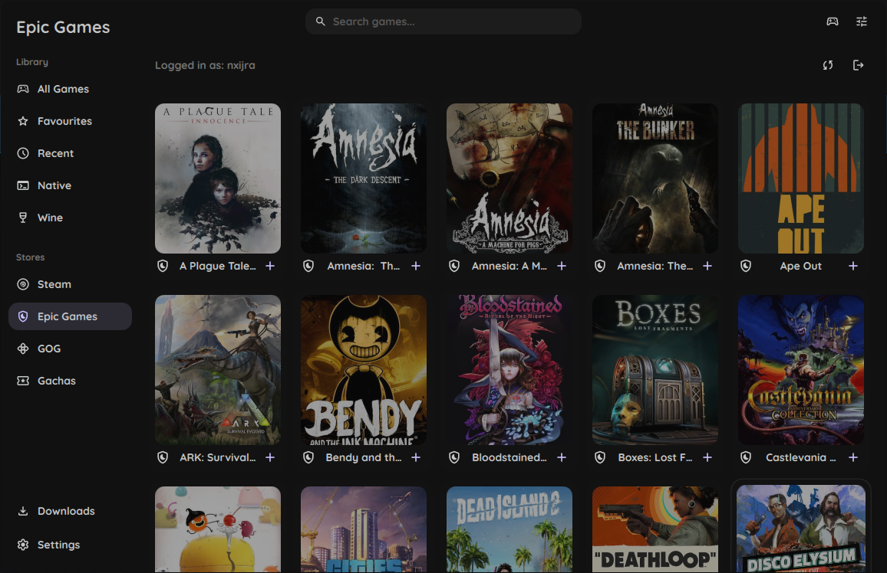

Omikuji uses `Legendary` to manage your Epic Games library and `gogdl` to manage your GOG library. You can scroll the page to see all the games you can install. By clicking the `+`, it opens an install dialog.

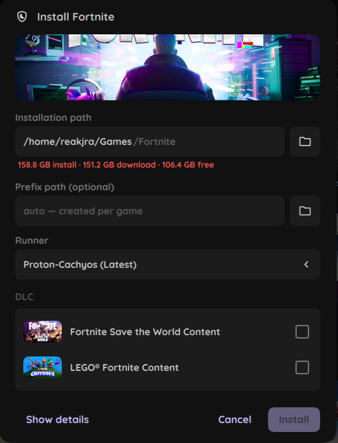

The `Installation path` field is where the game will be installed. 

The `Prefix path` field is the prefix you want the game to use when installed and added to the library.

`Runner` dropdown is where you can select the runner to use for the game. (Along with the prefix path, these two will just seed the game settings after the download is finished and the entry in library gets created, you can of course change them later in the game settings)

`DLC` checkboxes are where you can select the DLCs to install with the game. You can select multiple DLCs at once or select none at all.

All this applies to GOG installations too, they're the same.

#### Gacha

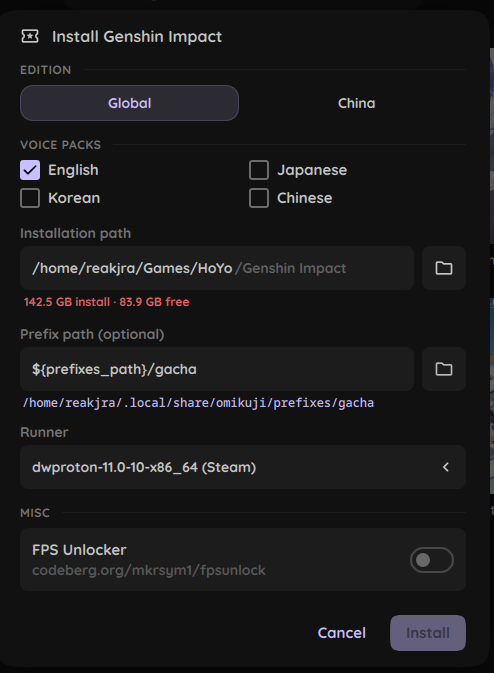

Gacha games are similar to Epic Games / GOG installations. However, some of them may come with the ability to toggle various voice packs installation. Also, if the game supports, you're able to change the version (Global, CN, JP, etc.)

Some gacha may come with additional things like, for example, Genshin Impact has a toggle to install the `Fps Unlocker`. If checked, it will install the latter alongside the game and will apply, in the game's settings, the `Run Alongside` field filled with the path to the unlocker executable.

Or additionally, some gacha may have a 'suggested' runner, which, if selected, will be installed on the spot and applied to that game (for example, hsr, that needs a specific `Dawn Winery` Proton to run). You still are able to select any other runner from the list and ignore the suggested one.

Also some gacha games may have a 'temp path' separated from the game's install path. The temp path is used for storing temporary files during the game's installation or update process. You can point the two in two different locations entirely. 

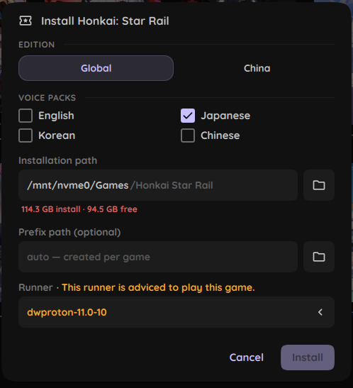

#### Manually

Games that don't come from a store get added by hand with the `+` button in the top right (and then `Add Game` in the small popup), which opens the `New Game` dialog.

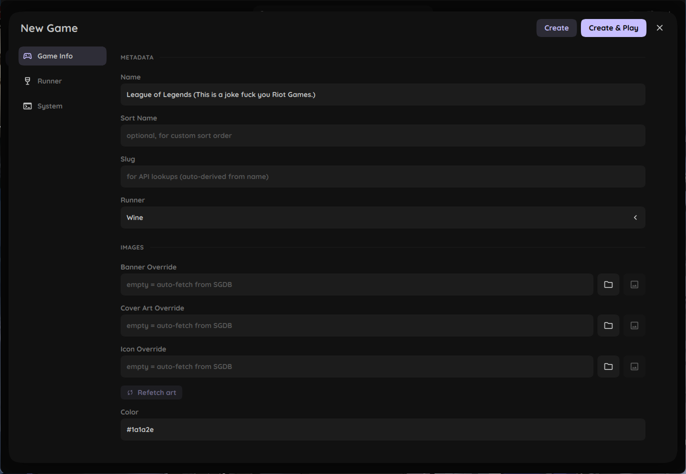

In the `Game Info` tab, a `Name` is the only thing actually required, everything else can be filled later. The `Runner` dropdown is the important one:

\- `Wine` for Windows games (`.exe`)

\- `Native` for Linux ones (binaries or `.AppImage`)

\- `Steam` to delegate the launch to the Steam client (requires the game to be installed in Steam)

\- `Flatpak` for flatpak apps.

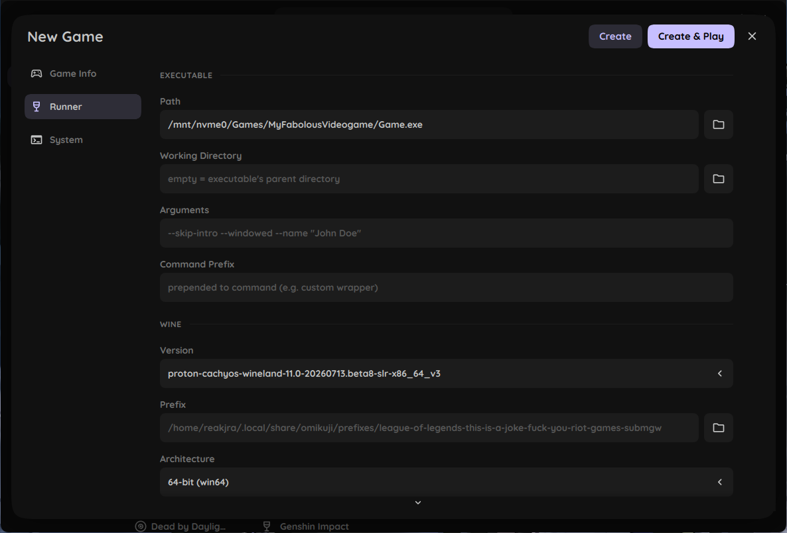

In the `Runner` tab you'll want the `Path` to the executable (for `Steam` and `Flatpak` you get an `Application ID` field instead), a `Version` (the wine or proton build it runs on, install one from Settings > Components if the list is empty or just drop one manually in the runners dir) and optionally a `Prefix`. Leave the prefix empty and omikuji creates a fresh one for that game.

`Create` adds it to the library, `Create & Play` adds it and launches it right away.

This is the short version. A good amount of fields in both tabs, plus the translation layers, environment variables and everything else, is covered in [Game Settings](#game-settings) below.

#### Import

If you want to add an Epic Games, GOG or Gacha game, you should NOT add them manually! Instead, go to the store the game is from and click the game card's `+` to open the dialog of the game you want to import.

##### Epic Games & GOG

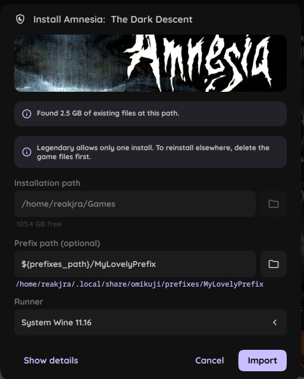

For both Epic Games and GOG, there are two situations:

\- The game is installed AND there's an entry in `Legendary`/`gogdl` `.json` files. This will lock the `path` since it already knows where the game to import is. Pressing `import` will add the game to the library with that path. 

\- The game is installed but there's no entry in `Legendary`/`gogdl` `.json` files. This will let you choose the `path` manually, since we want to import, you have to specify the path where the game is currently installed. Pressing `import` will add the game to the library with that path.

For **Repairs**, the game has to be installed and in the library. You'll find the game in the store, open the install dialog, it should resolve the installed path automatically (since it needs to be registered in the `Legendary`/`gogdl` `.json` files). Hit `repair` and it'll repair the game. Careful! `Legendary` will repair as the term intends! `GOG` will reinstall the game.

##### Gacha

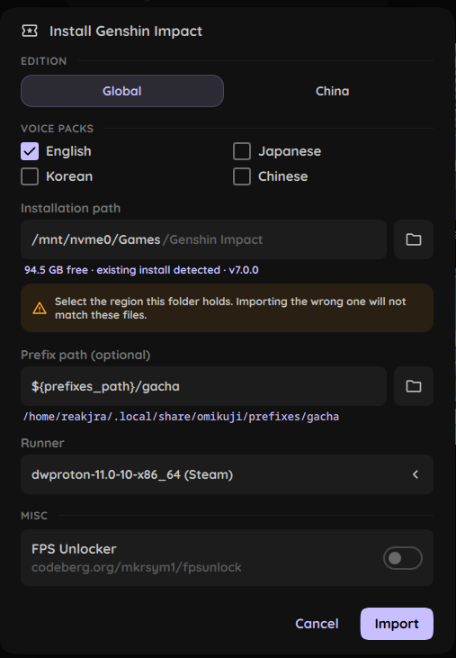

For Gacha games the pattern is the same, with the difference that you'll always have to specify the `path` manually. Also, as the note chip says when it successfully finds the game in the path specified, make sure to select the proper version of the game (e.g. Global, CN, etc.) so the game will be registered properly. This is important for gacha updates.

Also, for most games it'll detect the installed game version automatically.

Regarding repairs, for now only `HoYo` games support them.

### Downloads

You can check your own downloads in the `Downloads` tab in the left navbar.

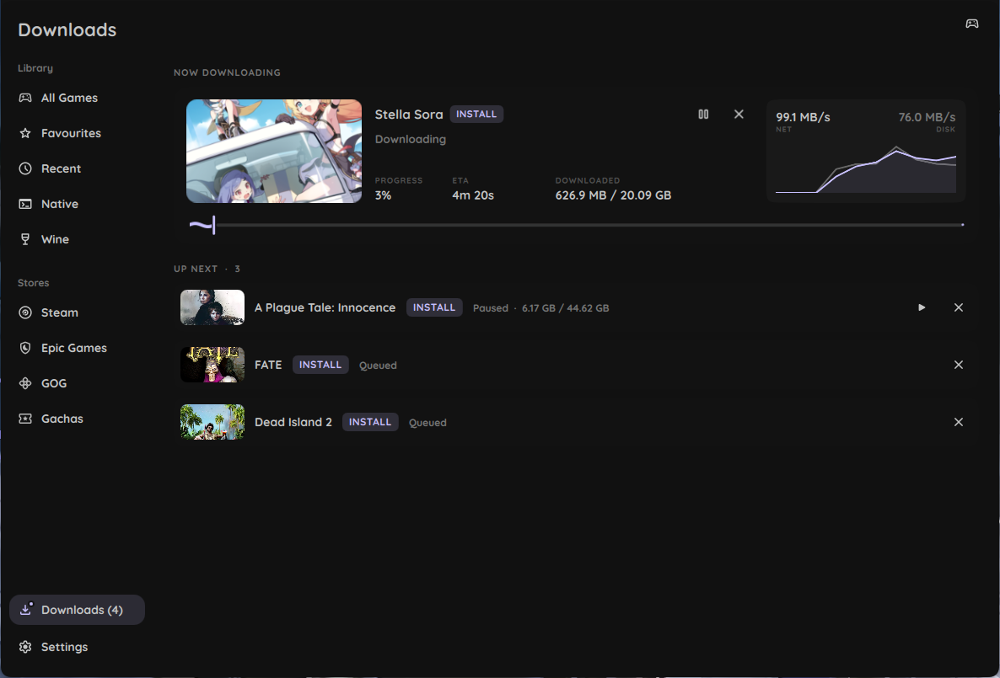

When starting a download from any store, if nothing is already in progress, the download will start automatically. If there is already a download in progress, the download will be queued and will start once the current download is finished or paused. 

From the page you can see the net speed, the disk usage, and the progress of the download.

## Game Settings

Per-game settings open from the library: right-click a game and click `Configure`, or use the gear button on the bottom floating bar. Changes are staged until you hit Save or Save & Play.

### Runner type

On the Game Info tab, the runner type decides how the game launches:

\- **Wine**: run a Windows game through wine or proton. The default for most things.

\- **Steam**: hand off to Steam, for imported Steam games.

\- **Native**: run a Linux binary or `.AppImage` directly.

\- **Flatpak**: launch an installed flatpak app.

The rest of Game Info (name, artwork, color) is optional and self-explanatory.

### Runner (Wine)

Wine/proton config. Only shown for Wine games. (we'll see the settings per header)

**Executable**

\- **Path**: the game's `.exe`.

\- **Working Directory**: where the process starts. Empty uses the exe's folder.

\- **Arguments**: passed to the game, e.g. `--skip-intro`, `-use-d3d12`.

\- **Command Prefix**: prepended to the whole launch command, for a custom wrapper.

**Wine**

\- **Version**: which wine/proton build to use.

\- **Prefix**: the wine prefix. Empty auto-creates a fresh one per game (named `<slug>-<id>`), the usual setup.

\- **Architecture**: 64- or 32-bit prefix.

**Translation Layers**

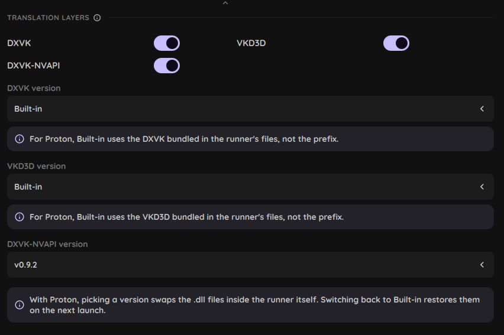

\- **DXVK**: Direct3D 9/10/11 to Vulkan.

\- **VKD3D**: Direct3D 12 to Vulkan.

\- **DXVK-NVAPI**: exposes NVIDIA features (DLSS, Reflex).

For this there are two things happening. First of all, toggling these layers (except `D3D Extras`) will show dropdowns. These dropdowns allow you to select the version of the layer to use. `Default (Global)` takes the version selected in `Settings => Components`.

Now, for `Proton`, since it overrides the wine prefix dlls for these layers, we simply cannot just swap the prefix ones only. So, when you enable this toggle, **on launch**, omikuji will swap the dlls in the wine prefix *and* the runner's built-ins. 

For `Wine`, since this doesn't occur, it will simply swap the prefix dlls. 

Omikuji tracks both the swapped ones and the old ones. So, let's say you have two games with `Proton`. Resident Evil Revelations and Cyberpunk 2077. If on the first game you enable a layer toggle, on launch, it will swap the dlls as said. Note that nothing will revert these dlls when you close the game. However, if you then run the second game, Cyberpunk 2077, that has these toggles OFF, it *will* revert them to the runner's default. So be careful, because if they're overridden, and you launch a game from another launcher, you will still be using the overridden dlls.

Also of course for wine it adds the env vars to work.

**Misc**

\- **Display**: DPI Scaling with a DPI slider.

\- **Drivers**: the wine Audio Driver (Default, PulseAudio, or ALSA).

\- **Graphics Driver**: X11/Wayland picker.

\- **DLL Overrides**: Key-value pairs of DLLs to override with their path.

### Runner (Steam)

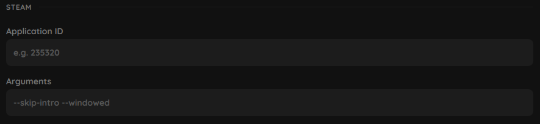

\- **Application ID**: The Steam application ID of the game.

\- **Arguments**: arguments to pass to the game.

### Runner (Native)

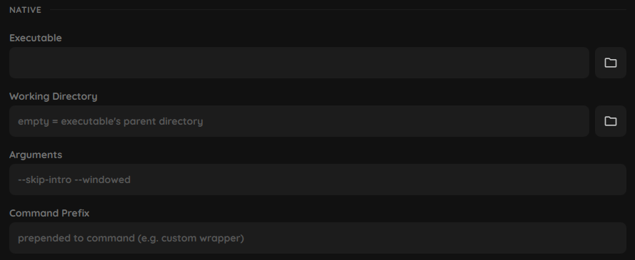

\- **Executable**: binary or `.AppImage` of the game path.

\- **Working Directory**: the parent directory of the game.

\- **Arguments**: arguments to pass to the game.

\- **Command Prefix**: prepended to the whole launch command, for a custom wrapper.

### Runner (Flatpak)

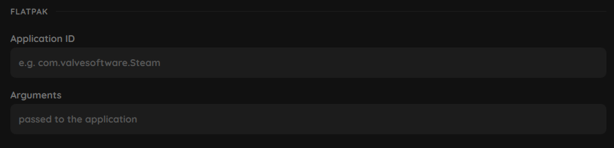

\- **Application ID**: the flatpak application ID of the app.

\- **Arguments**: arguments to pass to the game.

### System

**Performance**: GameMode (Feral's `gamemoderun`) and a CPU core limit.

**Display**: MangoHUD overlay and the GPU to run on. The GPU list comes from your installed Vulkan drivers, handy on multi-GPU setups to pin a game to the dGPU or iGPU.

**Audio**: Reduce Pulse Latency.

**Power**: Prevent Sleep keeps the screen awake while the game runs.

**Discord Rich Presence**: enable Discord Rich Presence for the game.

**Gamescope**: runs the game inside Valve's gamescope compositor. Enabling it exposes output and game resolution, an FPS and Refresh Rate cap, fullscreen or borderless, integer scaling, and an upscaling filter (FSR, NIS, nearest, linear) and HDR.

**Environment**: env vars to use when launching a game.
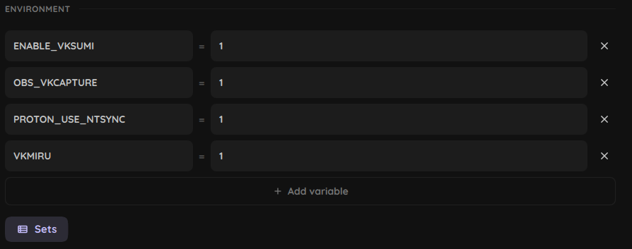

**Sets**: Stored env vars that you can:

\- **Sync** (they will be used along the current game's ones. Synced ones are not added in the game settings, so, changing a synced set will apply to all games) 

\- **Add**: (adding an env set will apply the contained vars to the game settings).

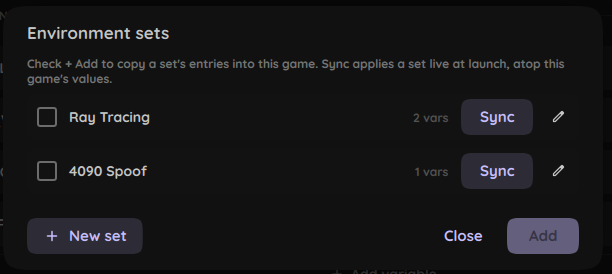

**Scripts**: 

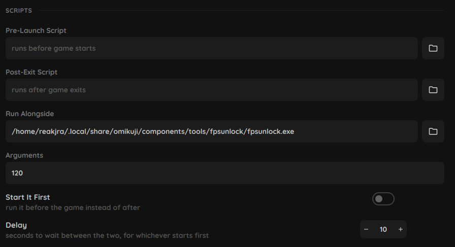

\- **Pre-Launch**: Script to run before launching the game (waits for the script to finish before launching the game).

\- **Post-Exit**: Script to run once the game exits (waits for the game to close before running).

\- **Run Alongside**: Script/Wine `.exe` to run alongside the game. 

When you fill the path field, it'll show you three more options below it: 

`Arguments`: arguments to pass to the script/binary.

`Start it First`: starts the script/binary before launching the game.

`Delay`: delay in seconds for the wait between the two (game and script/binary). For example, if `start it first` is disabled and you set `delay` to `10`, the game will launch first and then wait 10 seconds before running the script/binary.
 
### Epic

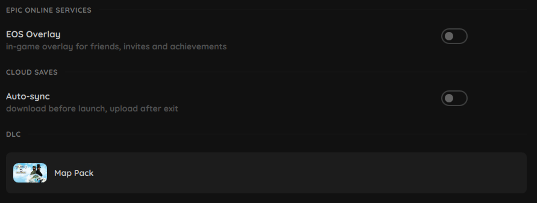

Only appears for Epic games.

\- **EOS Overlay**: installs and enables the Epic Online Services overlay for the game (if it's already installed you still need to enable it here, but it won't download again).

\- **Auto Sync**: Auto-sync pulls saves before launch and pushes them after exit. Save Path Override covers the case where the path isn't detected automatically. Note that it won't find the path if the game was never run first.

\- **DLC**: List of the installed DLCs for the game. `Legendary` allows you to uninstall them, just hover the dlc you want to remove and click the `x` on the right.

### GOG

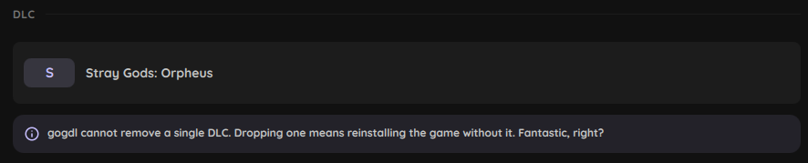

Only appears for GOG games.

\- **DLC**: List of the installed DLCs for the game. However, unlike `Legendary`, `gogdl` DLCs are not uninstallable.

But! If the page is empty, there's a cute dino!

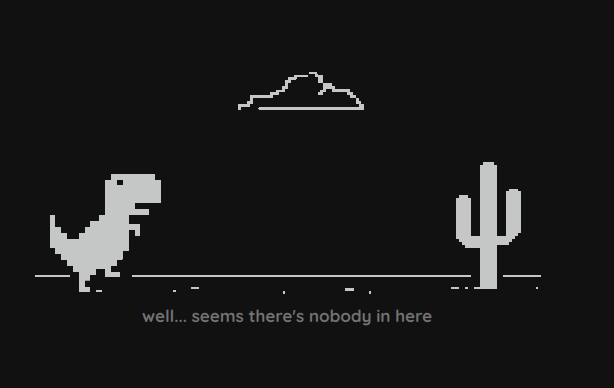

## App Settings

You can configure the app settings in the `Settings` tab in the left navbar.

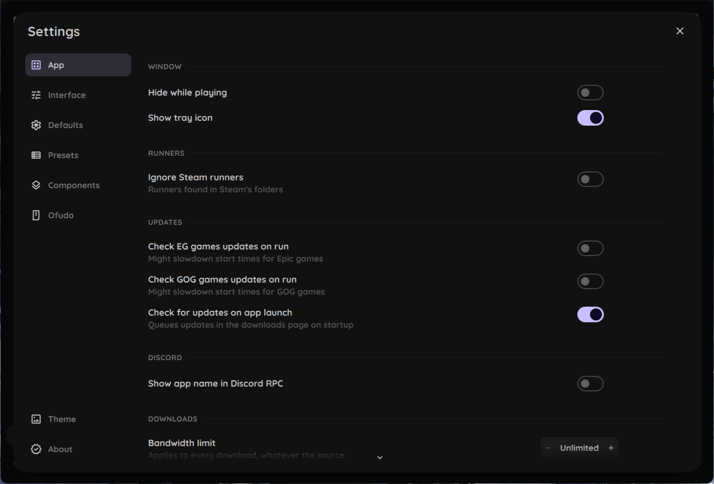

Here's a little explanation of the settings tabs. 

\- **App Settings**: General settings for the app. Mainly behavior. Such as tray toggle, Legendary / GOG threads, Bandwidth limits, update checks, and more.

\- **Interface**: This one for whatever is mainly the visual interface of the app. Language, zoom, card settings, icons, highlight logs (and rules), stores and library tabs toggle/drag.

\- **Defaults**: Defaults for games. These will seed the games you'll create in the library. It applies automatically for installed games, while, if you add them manually, they'll seed the fields automatically but you can still change them before creating the entry of the game. You can also use the top right button, `apply to existing`, to apply the defaults to all the games in the library (it has various checkboxes to decide which categories of options to apply to the games in the library).

\- **Presets**: `Environment sets` and `DLL overrides sets` for games. Sets are groups of key value pairs that you can copy in a game setting OR sync with the game's settings (in the game's settings). Syncing means that it does not copy the pairs in the game settings, but will apply them on top of the game's ones at launch. So, if you add lets say, a 'Raytracing' set and *sync* it with a game, if you in future change the pairs set, the game will have the new pairs applied without manually editing the game's settings. It also has `Template Literals` that allow you to use variables in some fields. For example, `${prefixes_path}` will resolve the `settings.toml` `paths.prefixes_dir` value. Useful if you want to back up your settings, change user, and all games will resolve with the new prefixes path without any manual intervention per-game. You can also make custom ones.

\- **Components**: Here you can manage your layers (`dxvk`, `vkd3d`), runners (`Wine-Spritz`, `Proton-GE`, `Proton-Cachyos`, etc.) and runtime (`umu-run`, `legendary`, `gogdl`, etc.) components. You can add sources for layers and runners from the `Add Source` button. Manage the already existing ones from the `Manage` button on each item (changing values, installing from Git releases, etc.). Runtime has a 'Check for Updates' button that checks if there's an update available for any of the runtime components. Also you can reinstall them or delete them with the `x` button on the right. The `Add Source` dialog is explained in [Adding a component source](#adding-a-component-source) below.

\- **Ofuda**: Essentially a prefix manager. Here it shows all your prefixes (in omikuji's `prefixes_path` *and* any prefix used by a game in the library). You can check their sizes, how many games use each prefix (`orphan` if no game uses it anymore). You can also manage them with the `Manage` button. It will open a dialog with some information about the prefix and some actions, such as `delete prefix` and basic `winetools` commands (`winecfg`, `winetricks`, `run wine command`, `kill wineserver`, etc.). It will also tell you precisely which games use the prefix. There's also a `new prefix` button on the top right of the page. It'll open a dialog to create a new prefix with a `Name` field, `Runner` and `Set` dropdowns. The `Set` is essentially `Game` or `Application` (they just install a bunch of stuff in the prefix)

\- **Theme**: Here you can change the theme of the application. There's a `follow system` toggle for colors, if enabled it will use `KDEPlasmaPlatformTheme6.so` to follow the system theme. If off, you can change the `Window background`, `content surface`, `accent`, `accent text`, `text`, `error`, `success`, `warning` colors. Also a Font section, same follow system toggle, a font family picker (needs restart) and font sizes dialog that has `display`, `headline`, `title`, `subtitle`, `body`, `label`, `caption`, and `micro` spinboxes (also a `reset all` button). At the bottom there's a `Corner radius` section that lets you manage various rounding spinboxes.

\- **About**: Information about the application, including version, license and various links. Also your system information that you can copy paste for opening an issue.

### Adding a component source

The `Add Source` button in `Components` lets you point omikuji at any repo that publishes runners or layers as release archives.

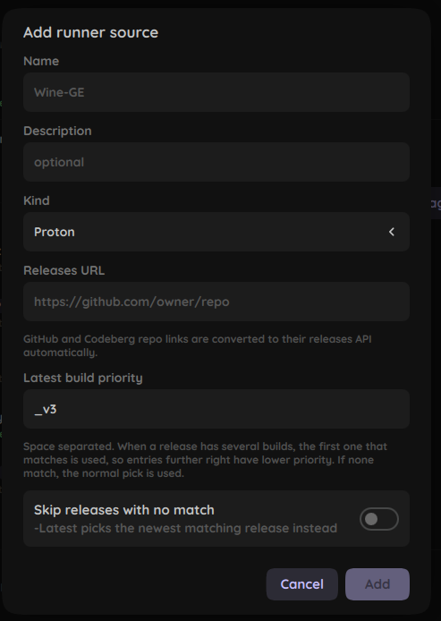

`Name` and `Releases URL` are the only required fields. `Description` is optional and `Kind` tells omikuji what the thing actually is (`Proton` or `Wine` for runners, `DXVK`, `VKD3D`, `DXVK-NVAPI` or `Other` for layers).

`Releases URL` takes a plain repo link, like `https://github.com/owner/repo`. You don't need to hunt down the API endpoint yourself, links get converted to their releases API automatically. When the link you typed differs from what omikuji will actually call, the converted URL shows up in small monospace right under the field, so you can check it resolved to what you expected. You can also directly enter the releases API URL if you know it.

`Latest build priority` only shows up for runners, and it's what makes the `-Latest` slot pick the right file. Some projects ship several builds per release (`_v3`, `_x86_64_v3`, `aarch64`, and so on) and you probably want a specific one every time. Write the tokens space separated, and the first one that matches wins, so anything further right is a lower priority fallback. If none of them match, omikuji falls back to its normal pick instead of giving up.

`Skip releases with no match` toggle appears once you've written a priority, and it changes what happens when the newest release has nothing matching your tokens. `Off`, `-Latest` takes that latest release anyway with the normal pick and follows the priority list. `On`, it skips an entire release if no match is found. Useful when a project occasionally publishes a release that doesn't include your build flavour and you'd rather stay on an older one than get the wrong file and/or undesired version.

### Move / Symlink to Steam `compatibilitytools.d`

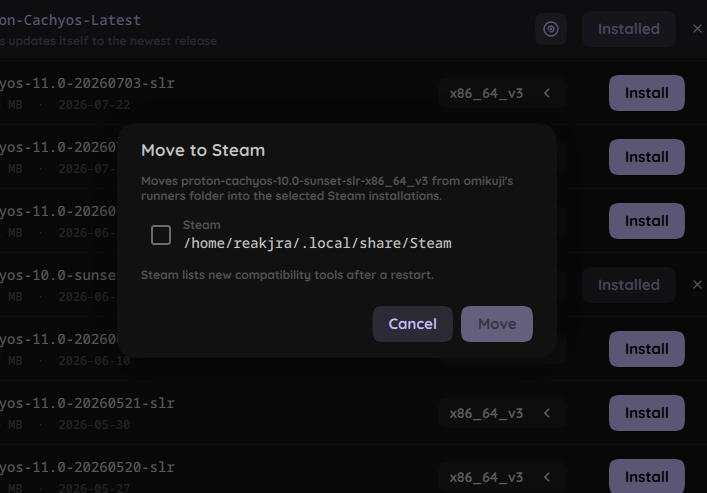

If you want, you can move an installed runner that is in the runners dir to the `compatibilitytools.d` directory to make it available to Steam (and omikuji), you can just click the Steam button in the runner manager, it'll open a dialog with the found Steam paths. If there's only one path it'll just move it there, if there are multiple paths (and you select more than one, since you could just select one), it'll copy the runner in each selected path. 

It changes a bit for the `-Latest` type of runners. In that case, it won't copy nor move, it'll symlink the folder to the `compatibilitytools.d` directory of each selected path. Why? Primarily because this way `-Latest` runners won't be duplicated in the runner selection dropdowns, and then because we have to manage the update of the runner on new releases. Also, only when we symlink, omikuji will overwrite the `compatibilitytool.vdf` file in the runner's folder to a generic `<runnername>-Latest`, with this when updating the runner, Steam won't deselect it for games that use it. (yes, Steam reads that file, if the display or internal name of the runner changes, Steam will deselect it from the games you're using it on, this prevents that.). Also, if you re-open the dialog, and there's a symlink already, you will be able to uncheck the path and remove the symlink (once you apply the edits ofc).

## Library Overview

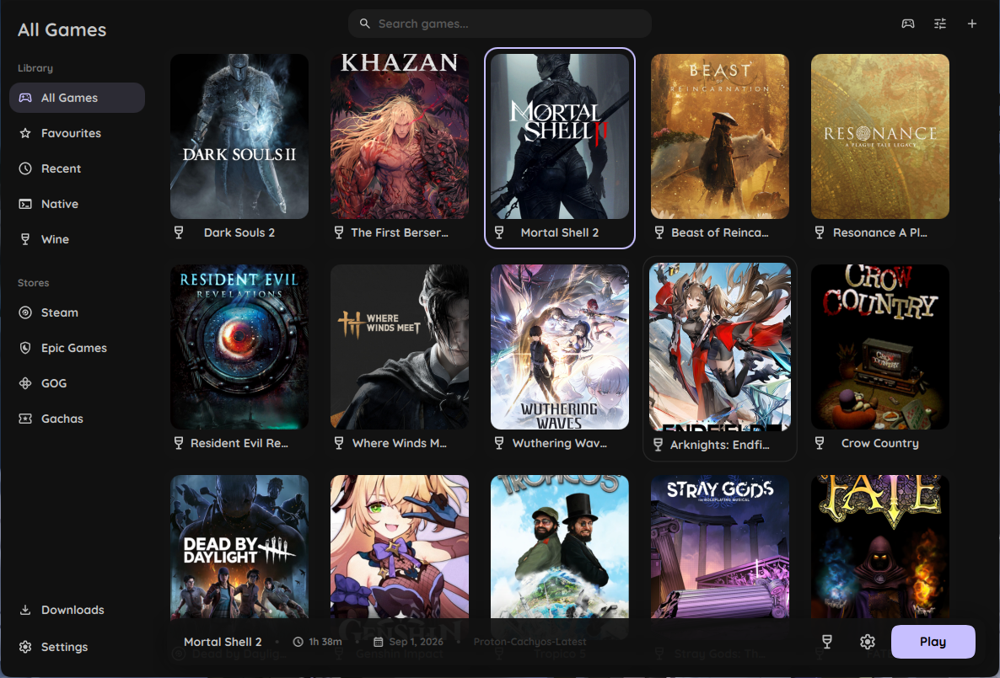

Just some things about the main library. On the left there's the navbar with the various categories for games and below them the stores, and at the bottom of the navbar we have the `Downloads` and `Settings` tabs (settings opens a dialog, downloads is a page). At center there's the main library view. When you click a game card, it'll outline it with an accent color and will show the bottom floating bar. In order, the floating bar has: Game title, Playtime, Last Played, Runner of the game on the left, then on the far right, still in order: Wine button (opens a context menu with `Configure (winecfg)`, `winetricks`, `Registry (regedit)`, `Command Prompt (cmd)`, `File Explorer (explorer)`, `Run EXE in prefix...`, `Run wine command...`, `Kill wineserver`). Running one of these will execute the corresponding action inside the selected game's prefix (also, they're 1:1 to the `Ofuda` buttons. Run wine command simply opens a dialog with a field where you can execute any wine command (winetricks is slow as balls to scroll through)). Then a gear button that opens the selected game settings, and a play button (has various states. `Play`, `Stop`, `Starting`.)

At the top of the library view there's a search bar. On the far right on the same row (top right edge of the window) there are three buttons. In order: `Console Mode` (opens console mode), `Quick settings` (opens quick settings popup for the library), `+` (opens a popup with `Add Game` and `Install Script` entries). 

Right clicking on a game card will open a context menu. Its entries are: 

\- **Play**: starts the game.

\- **Show Logs**: opens the game logs in a separate window.

\- **Configure**: opens the game settings dialog.

\- **Categories**: opens the game categories dialog.

\- **Browse Files**: opens the game files in the file manager.

\- **Add to favorites / Remove from favorites**: adds/removes the game from the favorites list.

\- **Hide/Unhide**: hides/unhides the game from the library.

\- **Shortcuts**: opens the game shortcuts subdialog. `Create desktop shortcut`, `Create application menu shortcut`, `Create Steam shortcut`. If they already exist, it'll be `Remove`.

\- **Duplicate**: duplicates the game entry.

\- **Remove**: removes the game entry. Hold `shift` and it becomes `Remove + prefix`, it will open a dialog to confirm. It will remove the game entry from the library and delete the game prefix.

### HoYo Games

\- **Repair**: repairs the game installation.

### Epic Games / GOG

\- **Check for updates**: checks for updates for the game and queues them in the downloads page if present.

\- **Uninstall**: removes the game installation (both from the library and the files on disk, also clears the `Legendary`/`gogdl` `.json` files).

### Quick Settings

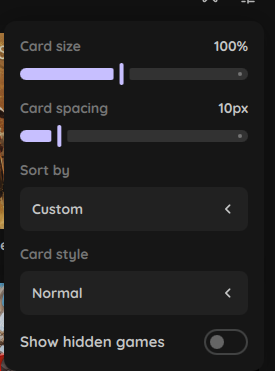

\- **Card size**: slider for the card size.

\- **Card spacing**: slider for the card spacing.

\- **Sort by**: dropdown for sorting the cards. `Custom` allows to hold a card with the left-click and drag it to reorder. `Date added`, `Name A-Z`, `Name Z-A`

\- **Card style**: dropdown for the card style. `Normal`, `Fit`, `Frameless`.

\- **Show hidden games**: toggle for showing hidden games.

## Community Scripts

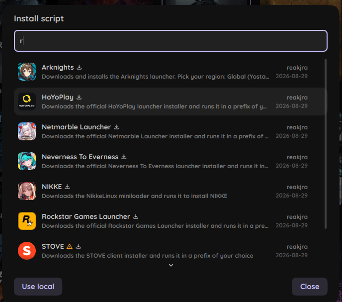

Community scripts are essentially a DSL, made with `.toml` files and hosted in the [scripts repository](https://github.com/omikuji-launcher/omikuji-scripts). They allow a user to run them for installing launchers, editing prefixes and such. 

To install one, click the `+` button and select `Install Script` in the tiny popup. The dialog will normally just show the locally installed scripts in the scripts directory. To query online ones, just type something in the search bar. They'll get listed. A script item has: an icon, a name, a small download icon beside it if it's not installed, below them a short description and on the far right the author name on top of the last updated date. 

Clicking a script pulls it locally and opens a new dialog. The fields in it are all declared in the script's `.toml` file. The only thing that is always present is the `show source` button that expands a code block with the script's source code. For more information, see the [scripts documentation](https://github.com/omikuji-launcher/omikuji-scripts/blob/master/README.md).

---

## Q&A

### Where does omikuji install its own stuff, creates prefixes and store stuff? and can I change it?

See [Configuration > `[paths]`](configuration.md#paths).

### My store page is empty, or it says I'm not logged in

See [Logging into Epic Games / GOG](#logging-into-epic-games--gog).

### Why can't I install Steam games from omikuji?

See [Steam](#steam).

### How do I add a game that doesn't come from a store?

See [Manually](#manually).

### How do I run a random `.exe` inside a game's prefix?

See [Library Overview](#library-overview).

### What's the difference between copying and syncing an env set?

See [App Settings](#app-settings).

### How do I make a runner available to Steam?

See [Move / Symlink to Steam `compatibilitytools.d`](#move--symlink-to-steam-compatibilitytoolsd).

### What are community scripts and how do I install one?

See [Community Scripts](#community-scripts).

### How do I point omikuji at my own scripts registry?

See [Configuration > `[scripts]`](configuration.md#scripts).

### How do I change the card size, sorting, or hide games?

See [Quick Settings](#quick-settings).

### How do I uninstall a Epic Games / GOG game?

see [Uninstalling a Game](#library-overview)

### Can omikuji use wine and proton builds already installed on my system?

Yes, they're picked up automatically, no configuration needed. The runner dropdown lists omikuji's own runners, every Proton in Steam's various `compatibilitytools.d` directories and your system wine.

### How do I update a game?

Several ways: 

\- **Epic Games / GOG**: Right click on the game in the library and select "Check for updates". Or you can enable the toggles that check for updates on game launch.

\- **Gacha**: Gachas are *always* checked on launch. 

All three share the `Settings -> App -> Check for updates on app launch` toggle. If on, it'll check for updates for all three and queues them in the downloads page if there are any.

### Do I need umu?

Only for Proton. The app doesn't implicitly install umu for you. You have a toggle in the welcome page or you can install it `Settings -> Components -> Runtime -> Install` on umu's button. It will ask you if you want to install umu in other occasions such as when you launch a game with proton but umu is not installed. Also if you have umu installed system-wide, omikuji will use that.

### A game ran once and now my DLL overrides (layers) are still in place

Turn off the toggles of the layers you activated and run the game again to make omikuji swap them back to the default ones.

### Where are the logs?

For games, logs can be seen by right clicking the game card and selecting `Show logs`. It will open a new window with the logs when you run the game. Also comes with a search (`Ctrl+F`), `clear`, `Copy all` and `Save` buttons. Or you can enable the automatic save on disk in `Settings -> App -> Save game logs to disk`.

### Can I install the same game twice?

For Epic Games and GOG, no. But you can install as many copies as you want of a gacha game.

### Can I use omikuji for regular apps instead of games?

Yes. Add the app the same way as a game and assign it a custom category. There is no separate "Apps" section, so it will also appear under All Games.
